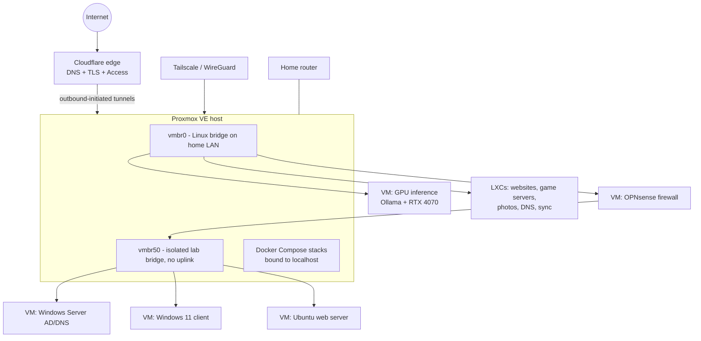

# homelab-infra-proxmox

Notes and docs for my home server. It's a single Proxmox VE node on consumer hardware running KVM VMs, LXC containers, and Docker workloads. This repo tracks what I built, why, what broke, and how I fixed it.

*Last updated: October 2026.*

## At a glance

| | |
|---|---|
| Hypervisor | Proxmox VE 9.2 on Debian 13 (standalone node) |
| CPU / RAM | AMD Ryzen 7 5700X3D (8C/16T, AMD-V) · 32 GB |
| GPU | NVIDIA RTX 4070, bound to `vfio-pci` and passed through to a VM |
| VMs (KVM) | GPU inference VM, plus an isolated CCDC-style security lab |
| Containers | LXC for lightweight Linux services, Docker Compose for app stacks |
| Storage | 2 TB NVMe LVM-thin pool for guest disks · SATA SSD for the host OS · 1 TB HDD for media/backups |
| Remote access | Cloudflare Tunnel + Cloudflare Access (no inbound ports) · Tailscale for private admin |

## Architecture



### Why it's built this way

| Decision | Why |
|---|---|
| **Proxmox** over bare metal | Isolation per workload, snapshots, easy rebuilds, one UI for VMs and containers |
| **VM** for GPU, Windows, firewall | Needs its own kernel/OS or direct hardware access |
| **LXC** for Linux services | Much lower overhead than a VM when I don't need a separate kernel |
| **Docker on localhost ports** | Apps aren't reachable on the LAN directly. The tunnel is the only entry point. |
| **LVM-thin on NVMe** | Thin provisioning + cheap snapshots for guest disks |
| **Cloudflare Tunnel** over port forwarding | No open inbound ports, origin IP stays private, identity checks happen at the edge |
| **Isolated bridge + OPNsense** for the lab | Intentionally vulnerable lab machines can't touch the home network |

## Cloudflare Zero Trust access

I wanted to reach the Proxmox UI and other services remotely without port forwarding. `cloudflared` runs as systemd services on the host, with named tunnels routing hostnames to internal services (Proxmox UI, SSH, several web apps).

- DNS for each hostname is a CNAME to the tunnel UUID rather than an A record. I learned this the hard way after hitting Cloudflare Error 1000.
- Proxmox uses a self-signed cert, so the origin config uses `noTLSVerify`. The browser-to-edge leg is still normal TLS.
- **The Proxmox UI is gated by Cloudflare Access** (email allowlist) before the request ever reaches the Proxmox login page, so there are two layers of auth.
- Tailscale (WireGuard mesh) is the private admin path that doesn't depend on Cloudflare.

## GPU passthrough + local LLM

The RTX 4070 is bound to `vfio-pci` at boot so the host never claims it, then passed to a dedicated Debian VM (`q35`, OVMF, `cpu: host`, `hostpci0 ... pcie=1,rombar=0`). That VM runs Ollama with Qwen models.

It backs the AI assistant on my [portfolio](https://willcoded0.github.io/portfolio/). GitHub Pages is static, so the browser calls a tunnel hostname that hits a small Python proxy on the GPU VM. The proxy:
- keeps the model endpoint and token server-side (never sent to the browser)
- owns the system prompt
- trims chat history and caps message/output size
- applies per-IP rate limiting using Cloudflare's `CF-Connecting-IP`

Lessons: only one VM can own a passed-through GPU at a time, and `x-vga=1` is wrong for a compute-only VM.

The first version of this ran on a GTX 1050 Ti. Details on that older build are in [homelab-llm-qwen](https://github.com/willcoded0/homelab-llm-qwen).

## Isolated security lab (CCDC practice)

A small enterprise-style environment for blue-team practice, on its own Linux bridge with **no physical uplink**:

| VM | Role |
|---|---|
| OPNsense | Firewall/router. The only thing connected to both the home LAN and the lab. |
| Windows Server 2025 | Active Directory Domain Services + DNS |
| Windows 11 | Domain-joined client |
| Ubuntu 24.04 | Web server (Apache) + SSH |

The lab runs on `10.50.0.0/24`. If the firewall VM is off, the lab has no way out. Each VM has an LVM snapshot of a clean "baseline," so I can break things and roll back in seconds. The Windows VMs use OVMF + TPM for Windows 11 / Server 2025.

## Pi-hole DNS + DHCP

AT&T residential gateways don't let you set custom DNS via DHCP, which makes network-wide ad blocking annoying. I worked around it by disabling DHCP on the gateway entirely and running Pi-hole in an LXC as the DHCP server, so every device got Pi-hole as its DNS with no per-device config.

Gotchas: IPv6. Modern OSes will use IPv6 DNS and skip the filter if you don't account for it. DoH/DoT and apps with hardcoded DNS also bypass Pi-hole, which is expected.

## Photos (Immich) and the thin-pool incident

Immich runs in Docker Compose inside an LXC. Docker inside an LXC on Proxmox needs:

```
lxc.apparmor.profile: unconfined
features: nesting=1,keyctl=1
```

**What broke:** a large photo import filled the LVM thin pool. That cascaded into PostgreSQL failures, container restart loops, and ext4 corruption inside the container.

**Recovery:** I diagnosed it through container logs and `dmesg` instead of blindly restarting, repaired the filesystem with `fsck.ext4`, and identified thin-pool exhaustion as the root cause.

**Fix:** photo media now lives on its own dedicated volume, separate from the container's root disk, so a runaway import can't starve the system disk. I also learned to monitor both thin-pool **data and metadata** usage.

UID/GID mapping matters too. In an unprivileged container, root maps to a high UID on the host (`100000+`), so bind-mounted storage has to be owned by the mapped UID.

## Docker workloads

Docker Engine runs app stacks via Compose: automation (n8n), media readers, dashboards, a game server, and local LLM tooling. Docker's data lives on its own logical volume so it can't fill the host root. Most services publish only on `127.0.0.1`, and Cloudflare Tunnel exposes the ones that need to be public.

## Storage layout

```
NVMe 2 TB  ── LVM VG "tforce"
              ├── thin pool "tforce-lvm"  → VM disks, LXC root filesystems, lab baseline snapshots
              ├── LV for Docker / containerd data
              └── LVs for ISOs and large app data

SATA SSD   ── Proxmox host OS (root + swap)

HDD 1 TB   ── media + directory storage used for backups
```

## Backups and recovery

- Scheduled `vzdump` snapshot-mode backups to the HDD (zstd, keep-last retention)
- LVM snapshot baselines for the lab VMs
- Runbook for thin-pool exhaustion (above)

## Related

- [homelab-llm-qwen](https://github.com/willcoded0/homelab-llm-qwen): earlier local LLM build
- [minecraft-dynmap-cloudflare-tunnel](https://github.com/willcoded0/minecraft-dynmap-cloudflare-tunnel)
- [willcoded0.github.io/portfolio](https://willcoded0.github.io/portfolio/)
